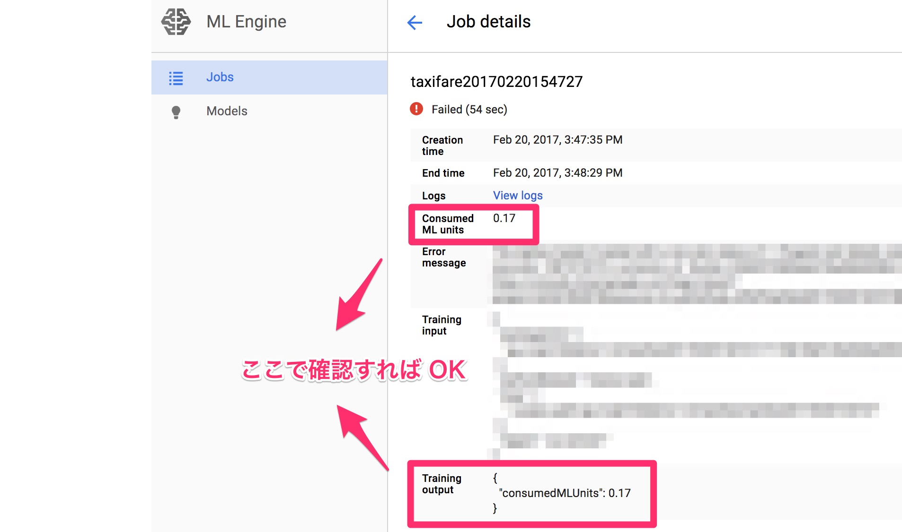

# 議事録

## Region の選択

* us-central はリソースが枯渇しやすいっぽい
  - US だとちょっとだけ安い
    - https://cloud.google.com/ml-engine/pricing
  - リソースが枯渇していると `Waiting for job to be provisioned.` の後に失敗とリトライを延々と繰り返してて悲しい

## 料金の確認

* `Waiting for job to be provisioned.` の段階では課金が発生するのかという疑問
  - 課金発生しないよ！

## 分散処理の最小構成

* 分散処理と Supervisor or MonitoredTrainingSession は大体セットで扱われているけど、実は必須ではない
  - [こんな感じ](http://qiita.com/shuhei_f/items/ba9c38f6f294d6a22b7d)で `tf.Session` に `server.target` を渡してやれば OK
  - `server.target` の中身は[たとえばこんな感じ](https://www.tensorflow.org/deploy/distributed#specifying_distributed_devices_in_your_model)

## MonitoredTrainingSession

じゃあ Supervisor とか MonitoredTrainingSession は何をやってくれているの？

### モデルとか summary の自動保存

* Summary を自動保存してくれるのは良いけど `feed_dict` を渡せないので placeholder を含むようなオペレーションだと駄目なのどうにかならんかな？

### Master や worker を良い感じに待ち合わせさせる

* Variable の初期化とか誰がやるか問題
  - Master だけにやらせようとすると、 worker の方が先に処理を始めちゃった時に初期化していない Variable を使おうとしてエラーを吐く
  - 全員にやらせようとすると先に初期化処理を終えて更新を始めたやつの努力が後から初期化しに来たやつに台無しにされる
    - プロセスの再起動とかやったら最悪

MonitoredTrainingSession や Supervisor には初期化処理のオペレーションを渡すことができる。
内部では master だけが初期化処理をやって worker はそれが終わるのをちゃんと待つように実装されているっぽい。

### 死んだ worker を復活させる

めっちゃありがたい機能だけど謎も多い。
色々検証しよう！

* Master が死んだらだめ？
* プロセス単位で死んだ場合とスレッドが例外を吐いた場合それぞれどうなる？
* プロセス単位で死ぬと master はプロセスを起動する方法は知らないはずなので無理そう
* ML Engine の環境変数にはプロセスの起動のし方も入っているので、 ML Engine 上でならプロセスも復活みたいな実装は一応理論上可能っぽいが

### その他

* appengine ja night みたいな感じで TF ja night やろうぜ！
